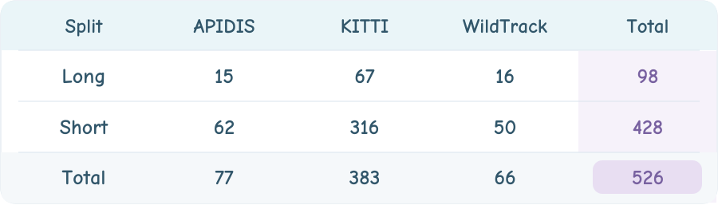

<a id="top"></a>

<div align="center">

<p></p>

<p></p>

<p>
<a href="https://arxiv.org/abs/2605.19390"></a>
&nbsp;
<a href="#framework-overview"></a>
&nbsp;
<a href="#demo"></a>
&nbsp;
<a href="#track4d-bench"></a>
&nbsp;
<a href="#citation"></a>
</p>

</div>

<a id="framework-overview"></a>

<p></p>

**Answer the question. Keep track of the object.** Trajectory-grounded multi-turn dialogue pairs spatiotemporal answers with structured 3D target trajectories, over a short clip or a queried segment of a longer video.

<p align="center">
  
</p>

**LMM-Track4D** combines **RTGE** for ray-time geometry encoding, a persistent **[TRK]** token for cross-turn state propagation, and **OSK-RA** for structured, query-conditioned 3D trajectory decoding. Together, these components maintain dynamic object states across time, viewpoints, and dialogue turns.

<a id="demo"></a>

<p></p>

<p align="center"></p>

<p align="center">
  <a href="assets/demo.mp4"></a>
</p>

<p align="center"><a href="assets/demo.mp4"><strong>Watch the full demo ↗</strong></a></p>

<a id="track4d-bench"></a>

<p></p>

<p align="center">
  
</p>

Track4D-Bench merges **APIDIS**, **KITTI Tracking**, and **WildTrack** into a unified multi-domain benchmark for track-conditioned 4D dialogue.

<p align="center"></p>

<a id="citation"></a>

<p></p>

If this work is useful to your research, please consider citing:

```bibtex
@misc{li2026lmmtrack4deliciting4ddynamic,
  title={LMM-Track4D: Eliciting 4D Dynamic Reasoning in LMMs via Trajectory-Grounded Dialogue},
  author={Chaoyue Li and Yongxue Xu and Jie Feng and Jiayu Ding},
  year={2026},
  eprint={2605.19390},
  archivePrefix={arXiv},
  primaryClass={cs.CV},
  url={https://arxiv.org/abs/2605.19390}
}
```

<div align="center">

<p></p>

Code will be released upon paper acceptance.

[Read the paper ↗](https://arxiv.org/abs/2605.19390) · [Coauthor's repository ↗](https://github.com/mikubaka88/LMM-Track4D) · [Back to top ↑](#top)

</div>
